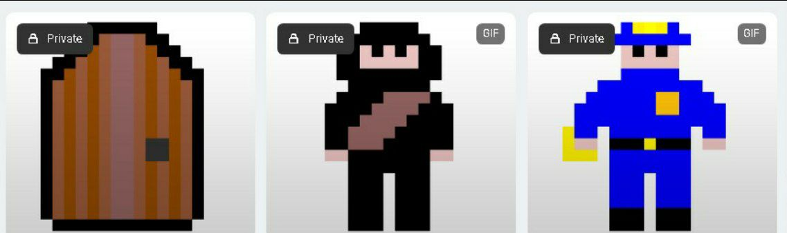
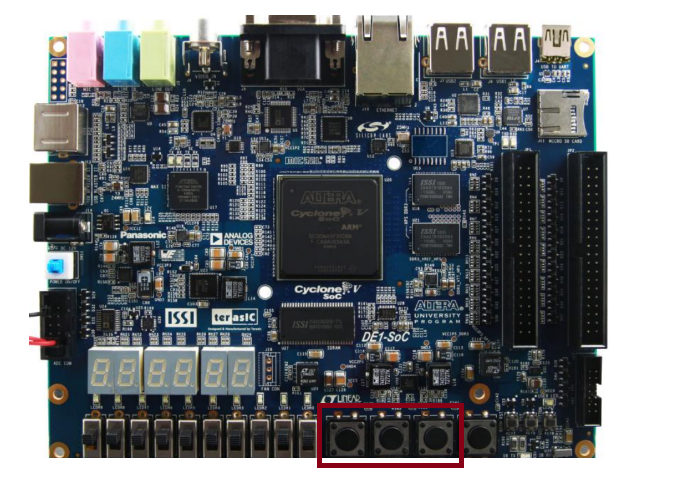

<h1 align="center"> Shadow Collision</h1>
<h3 align="center"> Um jogo em 2D feito para os amantes de jogos de plataforma desenvolvido para o kit de desenvolvimento DE1-SoC escrito em C</h3>

 

 
<h2 align="center"> Sobre o Jogo</h2>

  
Um jogo simples, porém divertido e com boa escalabilidade para atualizações futuras. Essa é a maior premissa desse projeto, que pondo de forma simples guiou toda a equipe durante seu desenvolvimento, aqui usando um hardware compatível você poderá reviver a emoção, e a nostalgia, marcantes da era de jogos 2D dos arcades.

O desenvolvimento desse projeto teve como base a FPGA DE1-SoC para a disponibilização de recursos utilizados pelo jogo. Os botões se resposabilizam por disponibilizar uma interface de controle para o usuário, que terá a sua disposição opções para, por exemplo, reiniciar o jogo ou pausar/continuar. Ainda na pla, o display será utilizado para a representação de 2 inforações vitais para o gameplay, sendo elas: o número de usos da habilidade de invisibilidade e o número de vidas remasnescentes do jogador. Ainda será solicitado da placa a conexão VGA (e também um cabo externo para conectar a mesma) para a transmissão das imagens do jogo para um monitor externo em que o jogo será devidamente renderizado. A porta USB disponibilizada permite a conexão de um mouse USB que será o principal instrumento para o andamento do jogo, se resposabilizando tanto pela movimentação, quanto para o uso da habilidade de invisibilidade do jogo.

Uma importante consideração a ser feita, é que a compatibilidade com outros sistemas não é assegurada, uma vez que diferentes dispositivos podem nem ao menos possuir os botões ou portas de I/O necessárias para o funcionamento adequado do jogo.

Os requisitos do desenvolvimento do sistema seguem abaixo:

* Iniciar o programa, mas sair sem iniciar o jogo.

* Iniciar o programa, e entrar no jogo.

* Em algum momento qualquer da jogatina, sair do jogo.

* Mostrar o número de vidas e usos de habilidades remasnescentes no mostrador de 7 segmentos.

* Apagar o display de 7 segmentos ao finalizar o jogo.

* Pausar e continuar o jogo ao pressionar de um botão.

* Pegar os troféus do mapa.

* Atualizar o display com a contagem das vidas remasnescentes.

* Atualizar o display com a contagem do uso de habilidade remasnescentes.

* Ganhar o jogo ao coletar os troféus e retornar ao ponto de extração.

* Reiniciar o jogo.

* Garantir que o jogador não possa ganhar o jogo seguindo ao ponto de extração sem os troféus

* Não permitir que o usuário atravesse as paredes.

* Impedir o uso da habilidade depois de se utilizar por 3 vezes.

<h2>  Equipe  </h2>
<uL> 
  <li><a href="https://github.com/LucaasGy">Lucas Gabriel Cerqueira Santos Lima</a></li>
  <li><a href="https://github.com/Lucas-L-Rodrigues">Lucas Lima Rodrigues</a></li>
  <li><a href="https://github.com/felipe-py">Luis Felipe Cunha Silva</a></li>
</ul>

<h1 align="center"> Sumário </h1>

	<ul>
        <li><a href="#equipamentos">  Descrição dos Equipamentos Utilizados</a></li>
        <li><a href="#arq_CPU">  Arquitetura da placa DE1-SoC
        </a></li>
        <li><a href="#Perifericos-utilizados"> Periféricos da Placa DE1-SoC Utilizados </a></li>
        <li><a href="#Drivers"> Drivers utilizados para o controle da GPU </a></li>
        <li><a href="#GPU utilizada"> GPU utilizada no projeto </a></li>
        <li><a href="#solucao-geral"> Solução Geral do projeto </a></li>
        <li><a href="#Interface do Usuário"> Interface do Usuário </a></li>
        <li><a href="#Dinamica do jogo"> Dinâmica do jogo </a></li>  
        <li><a href="#testes"> Testes</a></li>
        <li><a href="#execucaoProjeto"> Execução do Projeto </a></li>
        <li><a href="#referencias"> Referências </a></li>
	</ul>	

 
<h2> Descrição dos Equipamentos Utilizados</h2>

 

Nesta seção, são apresentados os equipamentos utilizados durante o desenvolvimento do projeto.

<h3> O kit de desenvolvimento DE1-SoC</h3>

A placa DE1-SoC é um kit de desenvolvimento que integra um processador ARM Cortex-A9 dual-core com um FPGA Cyclone V da Intel. Este dispositivo oferece uma variedade de periféricos, como display de 7 segmentos, porta Ethernet, USB, porta de áudio, entre outros, tornando-o adequado para projetos que exigem integração de software e hardware.

  

<strong>Kit de desenvolvimento DE1-SoC</strong>

<h3> Monitor CRT</h3>

O monitor DELL m782p foi utilizado para a exibição de testes e imagem final do projeto. Ele possui uma tela de visualização de 17 polegadas e uma resolução máxima de 1280x1024 pixels, além de utilizar a tecnologia CRT, que utiliza tubos de raios catódicos para o seu funcionamento. A saída VGA é a utilizada pelo monitor para a exibição de imagens.

  

<strong>Monitor CRT DELL</strong>

<h3> Mouse DELL M-UVDEL1</h3>

O Dell M-UVDEL1 é um mouse óptico com fio. Possui uma função padrão de dois botões, uma roda central clicável e um design de mão ambidestro. Além disso, usa um laser óptico vermelho padrão para rastreamento na parte inferior.

  

<strong>Mouse DELL</strong>

<h3> Linguagem C</h3>

A seleção da linguagem C foi motivada por sua eficiência, portabilidade e ampla adoção em sistemas embarcados. Sua sintaxe direta proporciona um controle preciso sobre o hardware, ao passo que suas bibliotecas padrão e ferramentas simplificam o desenvolvimento de código compacto e otimizado para dispositivos com recursos limitados.

<h3> Compilador GNU</h3>

O GCC, que significa "GNU Compiler Collection" (Coleção de Compiladores GNU), é uma distribuição integrada de compiladores amplamente adotada que suporta diversas linguagens de programação, como C, C++, Objective-C, Fortran, Ada, entre outras. Ao ser executado, o GCC atravessa etapas de pré-processamento, compilação, montagem e ligação. Ele disponibiliza uma vasta variedade de opções de linha de comando para personalização, o que simplifica a configuração de acordo com as necessidades específicas do desenvolvedor.

<h3>Vscode</h3>

O Visual Studio Code, também conhecido como VSCode, é um ambiente de desenvolvimento muito popular. Desenvolvido pela Microsoft, é um editor de código aberto e gratuito que oferece recursos como realce de sintaxe, conclusão automática de código e depuração integrada. Ele suporta uma variedade de linguagens de programação e possui um sistema de extensões que permite personalizar e estender suas funcionalidades. No projeto, o VSCode foi utilizado para desenvolver o código-fonte do jogo e formatar o README.

<h2>Drivers utilizados para o controle da GPU</h2>

Para que a imagem do jogo seja disponibilizada na tela do monitor é necessária a realização de um série de cálculos matemáticos que representarão as informações a serem exibidas na tela, bem como o transporte e a interpretação dos resultados desses cálculos. O transporte desses dados é realizado através de cabos que trocam informações nos barramentos e a interpretação da informação é feita através do comportamento de hardware específico, enquanto que a realização dos cálculos é delegada um hardware cujo comportamento será controlado por peças de software especiais, conhecidas como drivers, que na imprementação desse projeto serão do tipo "Kernel modules".

A FPGA utilizada nesse projeto, a DE1-SoC, já goza de um sistema operacional baseado em Linux bem como uma série de módulos que permitem o controle dos recursos da placa, a exemplo dos botões, dado que o projeto foi desenvolvido em C o processo de inclusão desses módulos pode ser feito ao adicionar o comando "-intelfpgaup" na compilação do código, e dentro do mesmo realizando a inclusão da biblioteca na forma: "#include <intelfpgaup/<b>nome_do_driver.h</b>>".

Com a implementação do driver e o uso de uma biblioteca para facilitar o acesso foram disponibilizadas as seguintes funções:

* open_driver: reposável por abrir o driver.
* close_driver: resposável por fechar o driver.
* set_cor_background_wbr: resposável por definir a cor de fundo da tela.
* set_sprite_wbr: resposável por exibir um sprite.
* edit_bloco_background_wbm: resposáve por editar um bloco no background.
* desabilita_bloco_background_wbm: resposável por desabilitar um bloco do background.
* edit_sprite_wsm: resposável por editar um pixel de um sprite armazenado ou criar um pixel de um novo sprite.
* set_quadrado_dp: reposável por desenhar um quadrado na tela.
* set_triangulo_dp: resposável por desenhar um triângulo na tela.
* limpar_tela: limpa a tela, removendo todas as estruturas já dispostas.
* preenche_buffer: resposável por preencher um buffer com as informações dos barramentos e enviá-las para a GPU.

 
<h2> Arquitetura da placa DE1-SoC</h2>

Nesta seção, será explorado a arquitetura da placa DE1-SoC, incluindo o processador ARM Cortex-A9, a estrutura de registros, a memória utilizada, a comunicação entre o processador e o FPGA, e o processo de compilação nativa na placa.

<h3>Visão Geral dos Recursos do Processador ARM Cortex-A9 </h3>

O processador ARM Cortex-A9 utiliza uma arquitetura de conjunto de instruções reduzido (RISC), com operações aritméticas e lógicas realizadas nos seus registradores de uso geral. O movimento de dados entre a memória e os registradores é feito por instruções Load e Store, utilizando uma palavra de 32 bits e endereçamento de bytes no formato little-endian.

<h3>Estrutura do Registro</h3>

O processador ARM Cortex-A9 possui 15 registros de uso geral (R0 a R14), um contador de programa (R15) e um registro de status de programa atual, CPSR, todos com 32 bits. Dois registros são tratados de maneira especial: R13 é o Stack Pointer e R14 é um registro de link na ligação de sub-rotina.

  

<strong>Registradores disponíveis e sua organização interna</strong>

<h3>Memória</h3>

O HPS inclui uma interface de memória que conecta o ARM MPCORE a uma memória DDR3 de 1 GB. Essa memória é comumente utilizada para armazenamento de programas e dados pelos processadores ARM. A memória é organizada em 256M x 32 bits e pode ser acessada por operações de palavra (32 bits), meia-palavra e byte.

<h3>Mapeamento de Periféricos Implementados</h3>

Os dispositivos implementados na FPGA são acessíveis ao processador ARM através do mapeamento na memória e podem ser acessados usando tanto a ponte HPS-to-FPGA quanto a ponte Lightweight HPS-to-FPGA. Quando um componente da FPGA está conectado a uma dessas pontes, os registradores mapeados
na memória estão disponíveis para leitura e escrita pelo HPS na posição de memória da ponte.

<h3>Diagrama de Blocos do Sistema DE1-SoC</h3>

O sistema DE1-SoC é formado pelo Hard Processor System (HPS) e FPGA dentro do chip Cyclone V. O HPS inclui um processador dual-core ARM Cortex-A9, uma porta de memória DDR3 e dispositivos periféricos. O FPGA implementa dois processadores Intel Nios II e diversas portas periféricas.

  

<strong>Diagrama da arquitetura da placa DE1-SoC</strong>

<h3>Comunicação entre Processador e FPGA via JTAG</h3>

A porta JTAG possibilita a comunicação entre a placa DE1-SoC e o computador host, permitindo a transferência de arquivos de programação FPGA para a placa DE1-SoC e o monitoramento através do programa Intel FPGA Monitor.

<h3>Compilação Nativa na Placa DE1-SoC</h3>

A compilação nativa ocorre quando um programa é compilado em um sistema para rodar na mesma arquitetura do próprio sistema. Neste caso, a compilação nativa de programas pode ser realizada na placa DE1-SoC através da linha de comando do Linux, utilizando sua cadeia de ferramentas de compilação integrada. O comando gcc invoca o GNU C Compiler, um compilador de código aberto amplamente utilizado para compilar programas Linux, já citado anteriormente.

 
<h2> Periféricos da Placa DE1-SoC Utilizados </h2>

A seguir, será feita as descrições gerais dos periféricos utilizados da placa DE1-SoC e seus aspectos mais importantes. A Figura abaixo mostra a placa FPGA, com as indicações dos seus dispositivos que serão citados.

  

<strong> Layout dos periféricos da placa</strong>

<h3>Gigabit Ethernet</h3>

A placa suporta a tecnologia de rede que permite a transmissão de dados a uma velocidade de até 1 gigabit por segundo (Gbps). Além de fornecer alta velocidade, também enterag desempenho confiável em redes locais, permitindo uma comunicação rápida e eficiente entre os dispositivos conectados à rede. 

Existem dois LEDs, LED verde (LEDG) e LED amarelo (LEDY), que representam o status da Ethernet PHY (KSZ9021RNI). A conexão da placa ao Gigabit Ethernet é estabelecida quando o LEDG acende.

<h3>Porta de Saída de Vídeo</h3>

A placa é equipada com uma porta de saída de vídeo com um controlador VGA, que pode ser conectada a qualquer monitor VGA padrão. A saída suporta uma resolução de 680x480, a imagem gerada é derivada de duas fontes principais, um <i>pixel buffer</i> e um <i>character buffer</i>.

<h3>USB Host</h3>

A placa possui duas portas USB 2.0 tipo-A com um controlador SMSC USB3300 e um controlador de hub de 2 portas. 

O dispositivo SMSC USB3300 de 32 pinos faz interface com o controlador de hub SMSC USB2512B, hub este que permite expandir o número de portas USB disponíveis na placa, permitindo que mais dispositivos USB sejam conectados. Este dispositivo suporta UTMI+ Low Pin Interface (ULPI), que se comunica com o controlador USB 2.0 em HPS. 

O PHY, responsável por lidar com a camada física da comunicação USB, incluindo a modulação/demodulação de sinais elétricos, opera no modo Host conectando o pino ID do USB3300 ao terra. Ao operar no modo Host, o dispositivo é alimentado pelas duas portas USB tipo A.

<h3>Botões</h3>

A placa disponibiliza quatro botões para utilização. Os dados de leitura dos botões são armazenados em um registrador de dados, com seus quatro bits menos significativos representando cada um dos botões. Quando um botão é pressionado, o seu respectivo bit é setado para 1, e quando é solto, para 0.

Existem outros dois registradores, o "interruptmask" e o "edgecapture". Esses registradores possuem um bit para cada botão, como o registrador de dados, porém, com funções diferentes. O "interruptmask" pode habilitar interrupções para cada botão, setando o seu respectivo bit para 1. O "edgecapture" seta o bit para 1 quando o botão é pressionado, e permanece nesse valor até que seja zerado diretamente. Setar um bit do "edgecapture" para 0 pode ser feito escrevendo o valor 1.

<h3>Display de 7 segmentos</h3>

 
<h2> GPU utilizada no projeto</h2>

O projeto desenvolvido utiliza uma GPU desenvolvida por um ex-discente do curso de Engenharia de Computação da Universidade Estadual de Feira de Santana (UEFS), todos os elementos disponíveis para uso que a GPU possui são utilizados no jogo.

Para mais informações sobre a arquitetura da GPU utilizada no projeto e sua comunicação com o driver que a controla, acesse o link abaixo. Nele, está disponível um projeto que tem como foco principal a criação de um driver que realize a comunicação entre a presente GPU e o HPS da placa DE1-Soc.

[PBLSD Barramentos - GitHub Repository](https://github.com/felipe-py/PBLSD_Barramentos)

 
<h2> Solução Geral do projeto </h2>

A solução abrangente deste projeto reflete sua total capacidade de atender a todos os requisitos especificados.

Para melhor compreensão do processo, fornecemos o seguinte diagrama de fluxo detalhando os passos descritos na solução geral.

  

<strong> Fluxograma da solução geral do problema</strong>

 
<h2> Interface do Usuário</h2>

Aqui discutiremos todas as interfaces desenvolvidas para o jogo, além de todas as interações possíveis que podem ser realizadas pelo jogador durante a partida.

Demonstraremos também a integração com os botões e display de sete segmentos, assim como a utilização do mouse para a jogabilidade do usuário.

O primeiro elemento que pode ser visualizado com a inicializaçao do jogo é a tela inicial abaixo, nela é aparesentado o nome do jogo e duas opções que podem ser seguidas pelo usuário. O jogo pode ser iniciado, ao clicar no botão 01 da placa, assim como é permitida a saída do jogo com o clique no botão 03.

  

<strong> Tela Inicial do jogo </strong>

Dois sprites foram desenvolvidos para a tela inicial, um que representa um "play" para iniciar o jogo e outro que representa a opção de saída. Eles podem ser visualiados na imagem abaixo.

  

<strong> Sprites de play e saída do jogo, respectivamente </strong>

Caso o usuário a partir da tela inicial decida sair do jogo, é feita a transição para uma nova tela onde uma mensagem de despedida é exibida. Após a mensagem a tela é apagada automaticamente e o jogo é encerrado, o gif abaixo demonstra o processo descrito anteriomente.

  

<strong> Transição da tela inicial para a saída do jogo </strong>

Escolhendo a opção para início da partida, o usuário é automaticamente direcionado para a partida, a transição pode ser vista no gif abaixo.

  

<strong> Transição da tela inicial para a partida </strong>

A tela de partida exibe de forma geral o mapa do jogo, todos os elementos ativos e passivos são exibidos automaticamente assim que a partida se inicia, as relíquias que devem ser roubadas pelo ladrão (representadas por troféus), os políciais, a porta de saída e o ladrão são os elementos principais desta tela. 

Três sprites foram criados de forma exclusiva para a partida, o ladrao de relíquias que representa o jogador, os policias que estão em busca do ladrão e a porta de saída do jogador para fuga e finalização vitoriosa do jogo. Eles podem ser vistos na imagem abaixo.

  

<strong> Sprites criados (Porta, ladrão e policial) respectivamente </strong>

Durante a partida o jogador tem a opção de pausa-la ao clicar no botão 02 da placa, a transição para o pause pode ser vista abaixo.

  

<strong> Pausando a partida </strong>

Assim que o jogo entra em pausa um sprite é exibido no canto superior direito da tela, ele basicamente indica com a utilização de duas barras paralelas verticalmente posicionadas, se o jogo se encontra pausado ou não. Na imagem abaixo podemos visualiza-lo com mais clareza.

  

<strong> Sprite de pause do jogo </strong>

Estando na tela de pause o jogador pode sair do pause e continuar o jogo, reiniciar o jogo ou encerra-lo.

Nos gifs a seguir, podemos visualizar cada uma destas transições.

  

<strong> Transição do pause para continuação da partida </strong>

  

<strong> Transição do pause para reinicialização da partida </strong>

É possível observar que assim que a partida é reiniciada após o pause, o ladrão retorna ao local de origem de sua origem no jogo.

  

<strong> Transição do pause para encerramento da partida </strong>

Em caso de derrota, o jogador é direcionado para a tela de "Game Over". Nela são apresentados os mesmos sprites da tela inicial, eles representam a opção de jogar novamente (play) ou sair do jogo.

  

<strong> Transição do jogo para a tela de derrota </strong>

Ao vencer o jogo, o usuário é direcionado para uma nova tela com uma mensagem de vitória. São apresentadas as mesmas opções com os sprites já vistos anteriormente, em ambos os casos as funções se repetem.

  

<strong> Transição do jogo para a tela de vitória </strong>

O número de vidas e poder especial disponíveis ao ladrão são apresentadas no display de 7 segmentos. Enquanto a partida não esta ocorrendo, o display não exibe nenhum tipo de informação válida para o jogo. Durante a partida as informações exibidas pelo display são atualizadas automaticamente.

A imagem abaixo demonstra o display de 7 segmentos em uma situação em que a partida está inativa, ou seja, na tela inicial, em derrota ou vitória.

  

<strong> Display de sete segmentos em momento de partida inativa </strong>

Em uma situação em que a partida esta ocorrendo, o display exibe o número de vezes que a habilidade furtiva ainda pode ser usada e o número de vidas disponíveis ao ladrão. Na imagem abaixo podemos visualizar o display nesta situação.

  

<strong> Display de sete segmentos exibindo dados do ladrão </strong>

À esquerda do display é representada a habilidade furtiva e à direita o número de vidas.

Três botões dos quatro disponíveios na placa são utilizados no jogo, eles podem ser visualizados na figura abaixo.

  

<strong> Botões utilizados em destaque </strong>

O primeiro botão é utilizado para iniciar o jogo em qualquer umas das telas em que esta ação é permitida, para pausar e tirar o pause o segundo botão é utilizado, por fim, a função para encerramento do jogo em quaisquer uma das telas em que esta opção se apresente é responsabilidade do botão 3.

Por fim, o mouse é utilizado pelo usuário para a movimentação do ladrão pelo mapa, além disso seu botão esquerdo é usado para ativar a habilidade furtiva disponível ao jogador.

 
<h2> Dinâmica do jogo </h2>

 
<h2> Testes </h2>

A seguir, a descrição dos testes realizados para garantir o adequado funcionamento do driver e biblioteca.

<h3>Driver</h3>

Afim de garantir o correto carregamento e descarregamento no kernel do Linux do driver desenvolvido, além de algumas outras operações, foram realizados alguns testes descritos a seguir.

* Inicializando o módulo kernel através do comando "make" do arquivo Makefile. O módulo é compilado, inserido no kernel do Linux em tempo de execução e um nó para o dispositivo de caractere é criado. Mensagem de sucesso da inclusão do módulo é exibida. 

  

<strong>Carregando o módulo kernel no Linux</strong>

* Removendo o módulo kernel através do comando "make clean" do arquivo Makefile. Os arquivos gerados na compilação do módulo kernel são excluídos, o módulo é removido do kernel do Linux e o nó para o dispositivo de caractere é excluído. Mensagem de sucesso da exclusão do módulo é exibida.

  

<strong>Descarregando o módulo kernel do Linux</strong>

* Abrindo e fechando comunicação com o dispositivo de caractere. Abre e fecha biblioteca utilizando os comandos *open_driver()* e *close_driver()*. Mensagem de sucesso da operação é exibida.

  

<strong>Abre e fecha o arquivo especial</strong>

<h3>Biblioteca + Driver</h3>

Para teste das funções da biblioteca projetada em C, além de verificar sua correta comunicação com o módulo kernel carregado, foi desenvolvimento um código para gerar uma imagem utilizando os elementos fornecidos pela GPU de Gabriel Sá Barreto Alves. Os elementos utilizados e as funções necessárias para conclusão da imagem final serão descritos a seguir.

  

<strong>Imagem Final</strong>

* Céu (azul claro) -> <i>set_cor_background_wbr (azul = 6, verde = 4, vermelho = 3)</i>. Utilizado 1x.

* Sol (amarelo) -> <i>set_quadrado_dp (azul = 0, verde = 6, vermelho = 6, tamanho = 6, ref_x = 511, ref_y = 60, ordem_impressao = 0)</i> e <i>set_triangulo_dp (azul = 0, verde = 6, vermelho = 6, tamanho = 7, ref_x = 511, ref_y = 53, ordem_impressao = 1)</i>. Utilizados 1x cada.

* Nuvens (branco) -> <i>edit_bloco_background_wbm (bloco_x, bloco_y, azul = 7, verde = 7, vermelho = 7)</i>. Utilizado 31x.

* Gramas (verde) -> <i>edit_bloco_background_wbm (bloco_x, bloco_y, azul = 0, verde = 7, vermelho = 0)</i>. Utilizado 16x.

* Troncos 1 e 2 (azulado) -> <i>set_sprite_wbr (ativa_sprite = 1, cord_x = 140/471, cord_y = 463, offset = 16, registrador = 7/6)</i>. Utilizado 2x.

* Árvores 1 e 2 (vermelha) -> <i>set_sprite_wbr (ativa_sprite = 1, cord_x = 100/511, cord_y = 461, offset = 4, registrador = 4/5)</i>. Utilizado 2x.

* Aliens 1 e 2 (branco e vermelho) -> <i>set_sprite_wbr (ativa_sprite = 1, cord_x = 352/272, cord_y = 355, offset = 22, registrador = 2/3)</i>. Utilizado 2x.

* Maçaneta (barra azul) -> <i>set_sprite_wbr (ativa_sprite = 1, cord_x = 320, cord_y = 445, offset = 11, registrador = 1)</i>. Utilizado 1x.

* Teto da casa (marrom) -> <i>set_triangulo_dp (azul = 1, verde = 2, vermelho = 4, tamanho = 3, ref_x = 245/275/305/335/365/395, ref_y = 299, ordem_impressao = 6/7/8/9/10/11)</i>. Utilizado 6x.

* Porta da casa (marrom) -> <i>set_quadrado_dp (azul = 1, verde = 2, vermelho = 4, tamanho = 2, ref_x = 320, ref_y = 465/435, ordem_impressao = 4/5)</i>. Utilizado 2x.

* Janelas da casa (marrom) -> <i>set_quadrado_dp (azul = 1, verde = 2, vermelho = 4, tamanho = 2, ref_x = 360/280, ref_y = 365, ordem_impressao = 2/3)</i>. Utilizado 2x.

* Estrutura da casa (branco) -> <i>set_quadrado_dp (azul = 7, verde = 7, vermelho = 7, tamanho = 15, ref_x = 320, ref_y = 400, ordem_impressao = 12)</i>. Utilizado 1x.

Com o resultado da imagem final, foi possível comprovar a integridade dos dados recebidos e processados pelas funções da biblioteca, além da correta comunicação biblioteca + driver.

<h3>Outros testes</h3>

Também foram realizados testes para verificar a função *limpar_tela()*,que remove da tela todos elementos utilizados, e as verificações de erros de dados recebidos por parâmetro nas funções. Para os erros, foram testadas as funções <i>set_cor_background_wbr</i>, <i>set_sprite_wbr</i> e <i>set_quadrado_dp</i>.

* Limpando a tela. Função *limpar_tela()* é executada removendo todos os elementos utilizados.

  

<strong>Remove da tela elementos utilizados</strong>

* Passando *vermelho* maior que o permitido para <i>set_cor_background_wbr</i>. set_cor_background_wbr (azul = 0, verde = 0, <b>vermelho = 9</b>);

  

<strong>Função retorna mensagem indicativa ao erro capturado</strong>

* Passando <i>offset</i> menor que o permitido para <i>set_sprite_wbr</i>. set_sprite_wbr (ativa_sprite = 1, cord_x = 320, cord_y = 445, <b>offset = -3</b>, registrador = 1)

  

<strong>Função retorna mensagem indicativa ao erro capturado</strong>

* Passando <i>ref_x</i> e <i>ref_y</i> menor que o permitido de <i>tamanho</i> 1 para <i>set_quadrado_dp</i>. set_quadrado_dp (azul = 1, verde = 2, vermelho = 4, <b>tamanho = 1</b>, <b>ref_x = 3</b>, <b>ref_y = 2</b>, ordem_impressao = 0)

  

<strong>Função retorna mensagem indicativa ao erro capturado</strong>

A integração entre um driver que recebe informações do espaço de usuário e de uma biblioteca, que facilite o trabalho do programador no desenvolvimento de projetos que necessitem dos recursos desponibilizados pela GPU se mostrou eficaz. Nenhuma incoerência ou problema de desempenho foi encontrado neste quesito.

O desenvolvimento de uma imagem que utilize todos os elementos desenvolvidos, além de todas as funcionalidades disponíveis na GPU, comprova toda a integridade do sistema e sua completa funcionalidade.

 
<h2> Execução do Projeto  </h2>

Para uso do driver e biblioteca, é necessário seguir os seguintes passos para obter o código-fonte, compilar o código em C, inserir o driver no kernel Linux, criar nó de acesso ao dispositivo de caractere e executá-lo em um dispositivo FPGA DE1-SoC acoplado com a GPU de Gabriel Sá Barreto Alves. Na criação do nó, é necessário ajustar o major number alocado dinamicamente ao driver pelo kernel. Ademais, também é preciso ajustar o caminho onde os arquivos gerados na compilação do módulo kernel serão armazenados.

**Passo 1: Clonar o Repositório**

Abra o terminal e execute o seguinte comando para obter o código do repositório:

    git clone https://github.com/felipe-py/PBLSD_Barramentos.git

**Passo 1.1: Ajustando major number do nó para dispositivo de caractere**

Caso necessário, na regra "all" do arquivo Makefile, ajuste o major number correspondente ao alocado pelo kernel no momento do carregamento do driver no sistema. O major number corresponde ao "X" mostrado no comando abaixo:

    mknod /dev/driver_tp01_g02 c X 0
  
**Passo 1.2: Ajustando caminho de armazenamento dos arquivos gerados**

Caso necessário, na variável "PWD" do arquivo Makefile, ajuste o caminho referente a onde os arquivos gerados na compilação do driver serão armazenados. Substitua as letras "r","e","t" no comando abaixo, pelo diretório atual:

    PWD := /r/e/t/

**Passo 2: Carregando e configurando driver**

Para compilar, inserir o módulo kernel (driver) e criar um nó para o dispositivo de caractere (arquivo especial), use o comando:

    make

**Passo 3: Compilar o Código em C**

Para obter código teste da biblioteca, compile e execute o código usando o comando:

    make run

**Passo 4: Descarregando driver**

Para apagar os arquivos gerados de compilação do módulo, remover o módulo do kernel e seu nó (arquivo especial), use o comando:

    make clean

Para apagar todos os arquivos do diretório, use o comando:

    make clearAll

 
<h2> Referências  </h2>

ALVES, Gabriel Sá B.; DIAS, Anfranserai M.; SARINHO, Victor T.. Development of a Sprite-Based Architecture for Creating 2D Games in Reconfigurable Environments Using FPGA Devices. In: TRILHA DE COMPUTAÇÃO – ARTIGOS CURTOS - SIMPÓSIO BRASILEIRO DE JOGOS E ENTRETENIMENTO DIGITAL (SBGAMES), 21. , 2022, Natal/RN. Anais [...]. Porto Alegre: Sociedade Brasileira de Computação, 2022 . p. 283-288. 

DE1-SoC Board. Disponível em: https://www.terasic.com.tw/cgi-bin/page/archive.pl?Language=English&No=836&PartNo=4. Acessado em: 13 de maio de 2024.

Intel® FPGA University Program DE1-SoC Computer Manual. Disponível em: https://ftp.intel.com/Public/Pub/fpgaup/pub/Intel_Material/18.1/Computer_Systems/DE1-SoC/DE1-SoC_Computer_NiosII.pdf. Acessado em: 13 de maio de 2024.

Using Linux on DE-Series Boards. Disponível em: https://github.com/fpgacademy/Tutorials/releases/download/v21.1/Linux_with_ARM_A9.pdf. Acessado em: 13 de maio de 2024.

 
