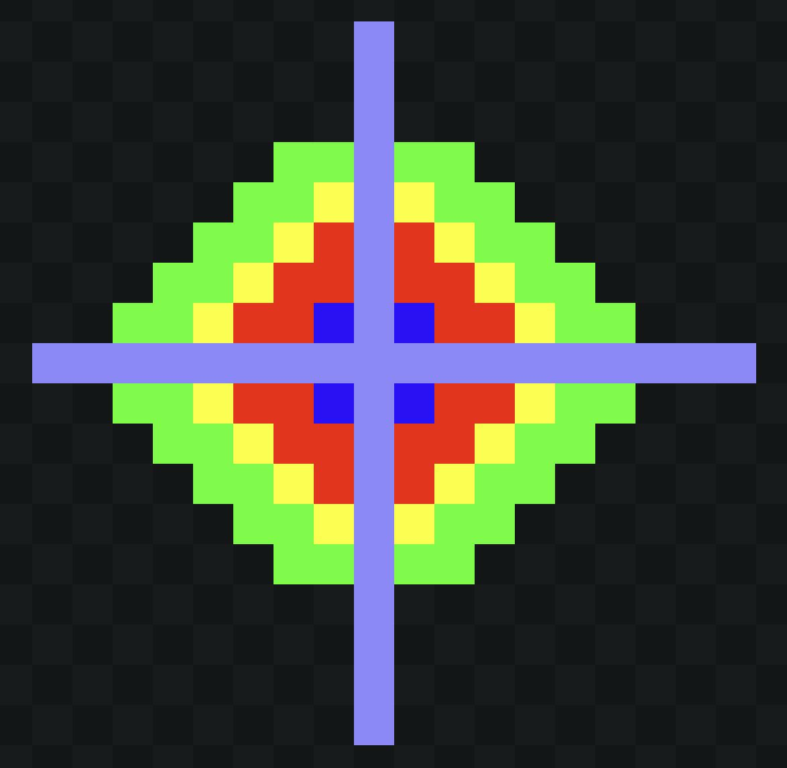
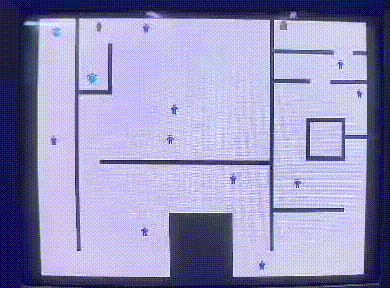

<h1 align="center"> Shadow Collision</h1>
<h3 align="center"> Um jogo em 2D feito para os amantes de jogos de plataforma desenvolvido para o kit de desenvolvimento DE1-SoC escrito em C</h3>

 

 
<h2 align="center"> Sobre o Jogo</h2>

  
Um jogo simples, porém divertido e com boa escalabilidade para atualizações futuras. Essa é a maior premissa desse projeto, que pondo de forma simples guiou toda a equipe durante seu desenvolvimento, aqui usando um hardware compatível você poderá reviver a emoção, e a nostalgia, marcantes da era de jogos 2D dos arcades.

O desenvolvimento desse projeto teve como base a FPGA DE1-SoC para a disponibilização de recursos utilizados pelo jogo. Os botões se resposabilizam por disponibilizar uma interface de controle para o usuário, que terá a sua disposição opções para, por exemplo, reiniciar o jogo ou pausar/continuar. Ainda na pla, o display será utilizado para a representação de 2 inforações vitais para o gameplay, sendo elas: o número de usos da habilidade de invisibilidade e o número de vidas remasnescentes do jogador. Ainda será solicitado da placa a conexão VGA (e também um cabo externo para conectar a mesma) para a transmissão das imagens do jogo para um monitor externo em que o jogo será devidamente renderizado. A porta USB disponibilizada permite a conexão de um mouse USB que será o principal instrumento para o andamento do jogo, se resposabilizando tanto pela movimentação, quanto para o uso da habilidade de invisibilidade do jogo.

Uma importante consideração a ser feita, é que a compatibilidade com outros sistemas não é assegurada, uma vez que diferentes dispositivos podem nem ao menos possuir os botões ou portas de I/O necessárias para o funcionamento adequado do jogo.

Os requisitos do desenvolvimento do sistema seguem abaixo:

* Iniciar o programa, mas sair sem iniciar o jogo.

* Iniciar o programa, e entrar no jogo.

* Em algum momento qualquer da jogatina, sair do jogo.

* Mostrar o número de vidas e usos de habilidades remasnescentes no mostrador de 7 segmentos.

* Apagar o display de 7 segmentos ao finalizar o jogo.

* Pausar e continuar o jogo ao pressionar de um botão.

* Pegar os troféus do mapa.

* Atualizar o display com a contagem das vidas remasnescentes.

* Atualizar o display com a contagem do uso de habilidade remasnescentes.

* Ganhar o jogo ao coletar os troféus e retornar ao ponto de extração.

* Reiniciar o jogo.

* Garantir que o jogador não possa ganhar o jogo seguindo ao ponto de extração sem os troféus

* Não permitir que o usuário atravesse as paredes.

* Impedir o uso da habilidade depois de se utilizar por 3 vezes.

<h2>  Equipe  </h2>
<uL> 
  <li><a href="https://github.com/LucaasGy">Lucas Gabriel Cerqueira Santos Lima</a></li>
  <li><a href="https://github.com/Lucas-L-Rodrigues">Lucas Lima Rodrigues</a></li>
  <li><a href="https://github.com/felipe-py">Luis Felipe Cunha Silva</a></li>
</ul>

<h1 align="center"> Sumário </h1>

	<ul>
        <li><a href="#equipamentos">  Descrição dos Equipamentos Utilizados</a></li>
        <li><a href="#arq_CPU">  Arquitetura da placa DE1-SoC
        </a></li>
        <li><a href="#Perifericos-utilizados"> Periféricos da Placa DE1-SoC Utilizados </a></li>
        <li><a href="#Drivers"> Drivers utilizados para o controle da GPU </a></li>
        <li><a href="#Algoritmos"> Algoritmos </li>
        <li><a href="#Mapeamento"> Mapeamento </li>
        <li><a href="#GPU utilizada"> GPU utilizada no projeto </a></li>
        <li><a href="#solucao-geral"> Solução Geral do projeto </a></li>
        <li><a href="#Interface do Usuário"> Interface do Usuário </a></li>
        <li><a href="#Dinamica do jogo"> Dinâmica do jogo </a></li>  
        <li><a href="#testes"> Testes</a></li>
        <li><a href="#execucaoProjeto"> Execução do Projeto </a></li>
        <li><a href="#referencias"> Referências </a></li>
	</ul>	

 
<h2> Descrição dos Equipamentos Utilizados</h2>

 

Nesta seção, são apresentados os equipamentos utilizados durante o desenvolvimento do projeto.

<h3> O kit de desenvolvimento DE1-SoC</h3>

A placa DE1-SoC é um kit de desenvolvimento que integra um processador ARM Cortex-A9 dual-core com um FPGA Cyclone V da Intel. Este dispositivo oferece uma variedade de periféricos, como display de 7 segmentos, porta Ethernet, USB, porta de áudio, entre outros, tornando-o adequado para projetos que exigem integração de software e hardware.

  

<strong>Kit de desenvolvimento DE1-SoC</strong>

<h3> Monitor CRT</h3>

O monitor DELL m782p foi utilizado para a exibição de testes e imagem final do projeto. Ele possui uma tela de visualização de 17 polegadas e uma resolução máxima de 1280x1024 pixels, além de utilizar a tecnologia CRT, que utiliza tubos de raios catódicos para o seu funcionamento. A saída VGA é a utilizada pelo monitor para a exibição de imagens.

  

<strong>Monitor CRT DELL</strong>

<h3> Mouse DELL M-UVDEL1</h3>

O Dell M-UVDEL1 é um mouse óptico com fio. Possui uma função padrão de dois botões, uma roda central clicável e um design de mão ambidestro. Além disso, usa um laser óptico vermelho padrão para rastreamento na parte inferior.

  

<strong>Mouse DELL</strong>

<h3> Linguagem C</h3>

A seleção da linguagem C foi motivada por sua eficiência, portabilidade e ampla adoção em sistemas embarcados. Sua sintaxe direta proporciona um controle preciso sobre o hardware, ao passo que suas bibliotecas padrão e ferramentas simplificam o desenvolvimento de código compacto e otimizado para dispositivos com recursos limitados.

<h3> Compilador GNU</h3>

O GCC, que significa "GNU Compiler Collection" (Coleção de Compiladores GNU), é uma distribuição integrada de compiladores amplamente adotada que suporta diversas linguagens de programação, como C, C++, Objective-C, Fortran, Ada, entre outras. Ao ser executado, o GCC atravessa etapas de pré-processamento, compilação, montagem e ligação. Ele disponibiliza uma vasta variedade de opções de linha de comando para personalização, o que simplifica a configuração de acordo com as necessidades específicas do desenvolvedor.

<h3>Vscode</h3>

O Visual Studio Code, também conhecido como VSCode, é um ambiente de desenvolvimento muito popular. Desenvolvido pela Microsoft, é um editor de código aberto e gratuito que oferece recursos como realce de sintaxe, conclusão automática de código e depuração integrada. Ele suporta uma variedade de linguagens de programação e possui um sistema de extensões que permite personalizar e estender suas funcionalidades. No projeto, o VSCode foi utilizado para desenvolver o código-fonte do jogo e formatar o README.

<h2>Drivers utilizados para o controle da GPU</h2>

Para que a imagem do jogo seja disponibilizada na tela do monitor é necessária a realização de um série de cálculos matemáticos que representarão as informações a serem exibidas na tela, bem como o transporte e a interpretação dos resultados desses cálculos. O transporte desses dados é realizado através de cabos que trocam informações nos barramentos e a interpretação da informação é feita através do comportamento de hardware específico, enquanto que a realização dos cálculos é delegada um hardware cujo comportamento será controlado por peças de software especiais, conhecidas como drivers, que na imprementação desse projeto serão do tipo "Kernel modules".

A FPGA utilizada nesse projeto, a DE1-SoC, já goza de um sistema operacional baseado em Linux bem como uma série de módulos que permitem o controle dos recursos da placa, a exemplo dos botões, dado que o projeto foi desenvolvido em C o processo de inclusão desses módulos pode ser feito ao adicionar o comando "-intelfpgaup" na compilação do código, e dentro do mesmo realizando a inclusão da biblioteca na forma: "#include <intelfpgaup/<b>nome_do_driver.h</b>>".

Com a implementação do driver e o uso de uma biblioteca para facilitar o acesso foram disponibilizadas as seguintes funções:

* open_driver: reposável por abrir o driver.
* close_driver: resposável por fechar o driver.
* set_cor_background_wbr: resposável por definir a cor de fundo da tela.
* set_sprite_wbr: resposável por exibir um sprite.
* edit_bloco_background_wbm: resposáve por editar um bloco no background.
* desabilita_bloco_background_wbm: resposável por desabilitar um bloco do background.
* edit_sprite_wsm: resposável por editar um pixel de um sprite armazenado ou criar um pixel de um novo sprite.
* set_quadrado_dp: reposável por desenhar um quadrado na tela.
* set_triangulo_dp: resposável por desenhar um triângulo na tela.
* limpar_tela: limpa a tela, removendo todas as estruturas já dispostas.
* preenche_buffer: resposável por preencher um buffer com as informações dos barramentos e enviá-las para a GPU.

 
<h2> Arquitetura da placa DE1-SoC</h2>

Nesta seção, será explorado a arquitetura da placa DE1-SoC, incluindo o processador ARM Cortex-A9, a estrutura de registros, a memória utilizada, a comunicação entre o processador e o FPGA, e o processo de compilação nativa na placa.

<h3>Visão Geral dos Recursos do Processador ARM Cortex-A9 </h3>

O processador ARM Cortex-A9 utiliza uma arquitetura de conjunto de instruções reduzido (RISC), com operações aritméticas e lógicas realizadas nos seus registradores de uso geral. O movimento de dados entre a memória e os registradores é feito por instruções Load e Store, utilizando uma palavra de 32 bits e endereçamento de bytes no formato little-endian.

<h3>Estrutura do Registro</h3>

O processador ARM Cortex-A9 possui 15 registros de uso geral (R0 a R14), um contador de programa (R15) e um registro de status de programa atual, CPSR, todos com 32 bits. Dois registros são tratados de maneira especial: R13 é o Stack Pointer e R14 é um registro de link na ligação de sub-rotina.

  

<strong>Registradores disponíveis e sua organização interna</strong>

<h3>Memória</h3>

O HPS inclui uma interface de memória que conecta o ARM MPCORE a uma memória DDR3 de 1 GB. Essa memória é comumente utilizada para armazenamento de programas e dados pelos processadores ARM. A memória é organizada em 256M x 32 bits e pode ser acessada por operações de palavra (32 bits), meia-palavra e byte.

<h3>Mapeamento de Periféricos Implementados</h3>

Os dispositivos implementados na FPGA são acessíveis ao processador ARM através do mapeamento na memória e podem ser acessados usando tanto a ponte HPS-to-FPGA quanto a ponte Lightweight HPS-to-FPGA. Quando um componente da FPGA está conectado a uma dessas pontes, os registradores mapeados
na memória estão disponíveis para leitura e escrita pelo HPS na posição de memória da ponte.

<h3>Diagrama de Blocos do Sistema DE1-SoC</h3>

O sistema DE1-SoC é formado pelo Hard Processor System (HPS) e FPGA dentro do chip Cyclone V. O HPS inclui um processador dual-core ARM Cortex-A9, uma porta de memória DDR3 e dispositivos periféricos. O FPGA implementa dois processadores Intel Nios II e diversas portas periféricas.

  

<strong>Diagrama da arquitetura da placa DE1-SoC</strong>

<h3>Comunicação entre Processador e FPGA via JTAG</h3>

A porta JTAG possibilita a comunicação entre a placa DE1-SoC e o computador host, permitindo a transferência de arquivos de programação FPGA para a placa DE1-SoC e o monitoramento através do programa Intel FPGA Monitor.

<h3>Compilação Nativa na Placa DE1-SoC</h3>

A compilação nativa ocorre quando um programa é compilado em um sistema para rodar na mesma arquitetura do próprio sistema. Neste caso, a compilação nativa de programas pode ser realizada na placa DE1-SoC através da linha de comando do Linux, utilizando sua cadeia de ferramentas de compilação integrada. O comando gcc invoca o GNU C Compiler, um compilador de código aberto amplamente utilizado para compilar programas Linux, já citado anteriormente.

 
<h2> Periféricos da Placa DE1-SoC Utilizados </h2>

A seguir, será feita as descrições gerais dos periféricos utilizados da placa DE1-SoC e seus aspectos mais importantes. A Figura abaixo mostra a placa FPGA, com as indicações dos seus dispositivos que serão citados.

  

<strong> Layout dos periféricos da placa</strong>

<h3>Gigabit Ethernet</h3>

A placa suporta a tecnologia de rede que permite a transmissão de dados a uma velocidade de até 1 gigabit por segundo (Gbps). Além de fornecer alta velocidade, também enterag desempenho confiável em redes locais, permitindo uma comunicação rápida e eficiente entre os dispositivos conectados à rede. 

Existem dois LEDs, LED verde (LEDG) e LED amarelo (LEDY), que representam o status da Ethernet PHY (KSZ9021RNI). A conexão da placa ao Gigabit Ethernet é estabelecida quando o LEDG acende.

<h3>Porta de Saída de Vídeo</h3>

A placa é equipada com uma porta de saída de vídeo com um controlador VGA, que pode ser conectada a qualquer monitor VGA padrão. A saída suporta uma resolução de 680x480, a imagem gerada é derivada de duas fontes principais, um <i>pixel buffer</i> e um <i>character buffer</i>.

<h3>USB Host</h3>

A placa possui duas portas USB 2.0 tipo-A com um controlador SMSC USB3300 e um controlador de hub de 2 portas. 

O dispositivo SMSC USB3300 de 32 pinos faz interface com o controlador de hub SMSC USB2512B, hub este que permite expandir o número de portas USB disponíveis na placa, permitindo que mais dispositivos USB sejam conectados. Este dispositivo suporta UTMI+ Low Pin Interface (ULPI), que se comunica com o controlador USB 2.0 em HPS. 

O PHY, responsável por lidar com a camada física da comunicação USB, incluindo a modulação/demodulação de sinais elétricos, opera no modo Host conectando o pino ID do USB3300 ao terra. Ao operar no modo Host, o dispositivo é alimentado pelas duas portas USB tipo A.

<h3>Botões</h3>

A placa disponibiliza quatro botões para utilização. Os dados de leitura dos botões são armazenados em um registrador de dados, com seus quatro bits menos significativos representando cada um dos botões. Quando um botão é pressionado, o seu respectivo bit é setado para 1, e quando é solto, para 0.

Existem outros dois registradores, o "interruptmask" e o "edgecapture". Esses registradores possuem um bit para cada botão, como o registrador de dados, porém, com funções diferentes. O "interruptmask" pode habilitar interrupções para cada botão, setando o seu respectivo bit para 1. O "edgecapture" seta o bit para 1 quando o botão é pressionado, e permanece nesse valor até que seja zerado diretamente. Setar um bit do "edgecapture" para 0 pode ser feito escrevendo o valor 1.

<h3>Display de 7 segmentos</h3>

A placa é equipada com seis displays de sete segmentos dispostos em três pares, os segmentos são do tipo anodo comum, ou seja, são ativados com nível lógico baixo e desativados com nível lógico alto. Os segmentos estão pinados a Cyclone V SoC FPGA.

 
<h2> GPU utilizada no projeto</h2>

O projeto desenvolvido utiliza uma GPU desenvolvida por um ex-discente do curso de Engenharia de Computação da Universidade Estadual de Feira de Santana (UEFS), todos os elementos disponíveis para uso que a GPU possui são utilizados no jogo.

Para mais informações sobre a arquitetura da GPU utilizada no projeto e sua comunicação com o driver que a controla, acesse o link abaixo. Nele, está disponível um projeto que tem como foco principal a criação de um driver que realize a comunicação entre a presente GPU e o HPS da placa DE1-Soc.

[PBLSD Barramentos - GitHub Repository](https://github.com/felipe-py/PBLSD_Barramentos)

 
<h2> Solução Geral do projeto </h2>

A solução abrangente deste projeto reflete sua total capacidade de atender a todos os requisitos especificados.

Para melhor compreensão do processo, fornecemos o seguinte diagrama de fluxo detalhando os passos descritos na solução geral.

  

<strong> Fluxograma da solução geral do problema</strong>

 
<h2> Interface do Usuário</h2>

Aqui discutiremos todas as interfaces desenvolvidas para o jogo, além de todas as interações possíveis que podem ser realizadas pelo jogador durante a partida.

Demonstraremos também a integração com os botões e display de sete segmentos, assim como a utilização do mouse para a jogabilidade do usuário.

O primeiro elemento que pode ser visualizado com a inicializaçao do jogo é a tela inicial abaixo, nela é aparesentado o nome do jogo e duas opções que podem ser seguidas pelo usuário, o início de uma partida ou o encerramento do jogo.

Ao lado da tela presente no jogo, temos o esboço criado inicialmente para o projeto. Os sprites de play e sair são representados de forma ilustrativa por quadrados de cor verde e vermelha, respectivamente.

O mesmo modelo de apresentação será utilizado para as outras telas desenvolvidas para o jogo.

  

<strong> Tela Inicial do jogo (esboço/versão final)</strong>

A seguir podemos visualizar os dois sprite foram desenvolvidos para a tela inicial, um que representa um "play" para iniciar o jogo e outro que representa a opção de saída.

  

<strong>Sprite criado para representar a opção de iniciar o jogo</strong>

  

<strong>Sprite criado para representar a opção de sair do jogo</strong>

Caso o usuário a partir da tela inicial decida sair do jogo, é feita a transição para uma nova tela onde uma mensagem de despedida é exibida. O esboço criado para esta tela pode ser visualizado abaixo.

  

<strong> Esboço da tela de saída do jogo </strong>

A tela de saída permanece ativa por alguns segundos e após isso é apagada, indicando que o jogo foi encerrado. 

  

<strong> Tela de saída do jogo </strong>

Escolhendo a opção para início da partida, o usuário é automaticamente direcionado a tela padrão contendo todos os elementos do jogo.

  

<strong> Tela padrão do jogo </strong>

A tela de partida exibe de forma geral o mapa do jogo, todos os elementos ativos e passivos são exibidos automaticamente assim que a partida se inicia, as relíquias que devem ser roubadas pelo ladrão (representadas por troféus), os políciais, a porta de saída e o ladrão são os elementos principais desta tela. 

Quatro sprites foram criados de forma exclusiva para a partida, a porta que representa a saída do jogador para a vitória, o ladrão em seu modo normal, o ladrão quando esta utilizando sua habilidade furtiva e o policial.

  

<strong> Sprites criados (Porta, ladrão, ladrão com habilidade e policial) </strong>

Durante a partida o jogador tem a opção de pausa-la ao clicar no botão 01 da placa, a transição para o pause pode ser vista abaixo.

  

<strong> Pausando a partida </strong>

Assim que o jogo entra em pausa um sprite é exibido no canto superior direito da tela, ele basicamente indica com a utilização de duas barras paralelas verticalmente posicionadas, se o jogo se encontra pausado ou não. Na imagem abaixo podemos visualiza-lo com mais clareza.

  

<strong> Sprite de pause do jogo </strong>

A seguir são apresentadas as telas de derrota e vitória de uma partida, as duas seguem a mesma metodologia da tela inicial com uma mensagem de derrota ("Game Over") ou vitória ("You Win"). São apresentadas as opçoes de jogar novamente ou sair do jogo, utilizando os mesmos sprites presentes na tela inicial.

  

<strong> Tela de derrota do jogo (esboço/versão final) </strong>

  

<strong> Tela de vitória do jogo (esboço/versão final)</strong>

O número de vidas e poder especial disponíveis ao ladrão são apresentadas no display de 7 segmentos. Enquanto a partida não esta ocorrendo, o display não exibe nenhum tipo de informação válida para o jogo. Durante a partida as informações exibidas pelo display são atualizadas automaticamente.

A imagem abaixo demonstra o display em uma situação em que a partida está inativa, ou seja, na tela inicial, em derrota ou vitória.

  

<strong> Display de sete segmentos em momento de partida inativa </strong>

Em uma situação em que a partida esta ocorrendo, o display exibe o número de vezes que a habilidade furtiva ainda pode ser usada e o número de vidas disponíveis ao ladrão. A seguir podemos visualizar esta situação.

  

<strong> Display de sete segmentos exibindo dados do ladrão </strong>

À direita do display é representada a habilidade furtiva e à esquerda o número de vidas.

 
<h2> Dinâmica do jogo </h2>

O objetivo principal do jogo Shadow Collision é fazer com que o ladrão roube as relíquias presentes no mapa sem que seja captura por nenhum policial, após os roubos ele deve retornar para o ponto de partida e sair de forma vitoriosa.

Nesta seção, serão apresentadas todas as dinâmicas e regras presentes ao longo de todo o jogo.

<h3>Controle do ladrão</h3>

No jogo, o jogador controla um ladrão que deve coletar troféus espalhados pelo mapa enquanto evita ser capturado por policiais. A movimentação é feita através do mouse que permite explorar o mapa e se esquivar dos policiais. Uma mecânica central é o "modo furtivo," que permite ao ladrão evitar ser detectado ao sacrifício de seus movimentos, facilitando a coleta de troféus em áreas de alta vigilância.

<h3>Tomadas de decisão</h3>
    
A jogabilidade exige decisões estratégicas, como escolher a rota ideal e o momento certo para usar o modo furtivo. A cada colisão com policiais, o jogador perde uma vida e os troféus coletados, aumentando a tensão e a necessidade de uma estratégia cuidadosa. Com o avanço no jogo, os desafios aumentam, exigindo do jogador habilidades cada vez mais refinadas para concluir os objetivos.

<h3>Recursos limitados</h3>
   Durante o jogo será necessário um controle cuidado de seus recursos: suas vidas, suas cargas de habilidade e seus troféus. Nenhum deles é recarregável durante o jogo, sendo que os troféus ainda podem ser perdidos caso o jogador seja pego por um guarda, um controle adequado de seus recursos é a chave da vitória.

<h3>Colisões</h3>
    Como descrito na sessão <a href="#Algoritmos">Algoritmos</a> existem um total de 4 colisões no jogo, cada uma com suas respectivas consequencias: a colisão com a parede, que impede o movimento do jogador, a colisão com um guarda que faz o jogador perder uma vida, a colisão com um troféu que garante o recurso, e a colisão com a porta que, caso o jogador já tenha os troféus, finaliza o jogo.

<h3>Pause e Continuar</h3>
    Durante qualquer momento durante a gameplay o jogador pode executar um conjunto de ações a depender do botão que ele pressionar na FPGA: ele pode pausar o jogo, reiniciar o jogo ou até mesmo sair do jogo. Considere ,no entanto, que essas ações tem suas disponibilizadas a depender do estágio do jogo (você não pode pausar o menu por exemplo).

<h3>Condição de vitória</h3>
    Para vencer o jogo, é preciso que o jogador retorne ao ponto de extração com 2 troféus que estão dispostos pelo mapa, a ordem de coleta, bem como a rota tomada ambos estão a cargo do jogador, tendo apenas a limitação das paredes no mapa.

<h3>Condição de derrota</h3>
    O jagador perde o jogo ao cumprimento de uma condição simples: ser capturado sem ter nenhuma vida restante. Para o cumprimento dessa condição será necessário que o jogador tenha sido pêgo 4 vezes, 3 vezes com vidas na reserva, e uma vez com o contador de vidas zerado.

<h2>Algoritmos</h2>

Esses algoritmos permitem a detecção de colisões, esses por sua vez se subdividem em:

* colisão com parede.

* colisão com um guarda.
    
* colisão com um troféu.
    
* colisão com a porta.

A colisão com parede não implica em penalidades para o jogador, caso ocorra ela apenas impede o avanço do ladrão, essa colisão é importante para garantir que o ladrão não poderá andar de forma completamente livre pelo mapa, o que aumentará o grau de desafio do jogo.

A colisão com um guarda possui penalidades par ao jogador, sendo elas: a perda de uma vida, a perda de todos os troféus, e o reestabelecimento da posição do jogador na posição inicial do ladrão. Esses princípios se aplicam a colisão com todos os guardas, sendo que a verificação é feita de forma individual para cada guarda.

A colisão com um troféu por sua vez tem um carácter recompensador, ao colidir com um trofeu o sprite do mesmo some e a contagem de troféus do ladrão aumenta, sendo que somente com todos os troféus o ladrão poderá concluir com sucesso sua missão.

A colisão com a porta se divide em 2 possibilidades: o ladrão tem ambos os troféus, ou não tem. Caso os troféus tenham sido coletados o jogador ganha o jogo, do contrário nada acontece e o jogo continua.

Todos os algoritmos de colisão funcionam de forma similar e registram a colisão no cumprimento de 2 requisitos, sendo eles: não estar em modo furtivo (usando a habilidade) e haver um contato entre o sprite do jogador com um determinado objeto do jogo. A primeira condição, apesar de estar sendo sempre verificada, só se efetiva na colisão com um guarda, afinal o ladrão não pode iniciar uma colisão sem se mover, e a movimentação é proibida no modo furtivo, logo caso o usuário colida com o troféu, por exemplo, a colisão é detectada antes da entrada em modo furtivo. A segunda condição já se apresenta em todas as colisões ao mesmo tempo, é necessário apenas uma variação das coordenadas que gere um contato contre os dois objetos para que se contretize.

<h3>Algoritmo de Threads </h3>

O algoritmo de threads é usado para gerenciar as interações do jogador com o jogo e os periféricos conectados à placa. São empregadas múltiplas threads para executar tarefas simultaneamente, como a interação com botões, manipulação de sprites e verificação de colisões. As threads são gerenciadas usando a biblioteca "pthread", o que permite a criação e sincronização de múltiplas linhas de execução dentro do programa.

Uma das threads principais criadas é a thread_botao, que lida com as interações do jogador com os botões de controle na FPGA. Além disso, threads são usadas para lidar com movimentos de sprites, tanto a movimentação dos guardas que ocorre de forma independente do jogador quanto do ladrão controlado pelo mouse. A sincronização entre essas threads é crítica para garantir que as ações, como a atualização do estado do jogo ou o acesso a recursos compartilhados, sejam realizadas de maneira ordenada e segura. Isso é feito utilizando a abordagem de mutex, que aplica uma trava que impede que múltiplas threads acessem dados críticos ao mesmo tempo, prevenindo condições de corrida e inconsistências de dados.

Este uso de threads e sincronização é fundamental para a execução eficiente do jogo, permitindo que o sistema responda rapidamente a entradas do jogador e eventos do jogo, enquanto realiza tarefas em segundo plano, como verificações de colisão e atualização de gráficos. As threads também permitem uma separação clara de responsabilidades dentro do código, onde diferentes threads são responsáveis por diferentes partes do jogo, facilitando a manutenção e a escalabilidade do software.

<h2> Mapeamento </h2>

Para realizar o acesso e o controle dos botões da FPGA foi utilizado mapeamento de memória com o uso do "mmap". Inicialmente, o arquivo especial /dev/mem é aberto, permitindo ao programa acessar diretamente a memória do sistema. Em seguida, a função mmap mapeia a região de memória que corresponde aos periféricos da FPGA para o espaço de endereço virtual do jogo. Isso inclui os registradores dos botões e dos displays de 7 segmentos, conectados à CPU através da "Lightweight Bridge". Assim, o programa pode interagir diretamente com o hardware da FPGA.

Após o mapeamento, uma série de ponteiros são direcionados a endereços de memória específicos, uma das resposábilidades desses ponteiros é a leitura de um registrador que indica o atual estado dos botões, e através dele é possível determinar quais botões estão pressionados, e quais não estão a depender do valor retornado.

O controle do display de 7 segmentos na FPGA é realizado através de ponteiros de endereço virtual que apontam para registradores específicos, representando cada um dos dígitos do display. Após o mapeamento da memória da FPGA esses ponteiros (HEX0_ptr até HEX5_ptr) são inicializados para o espaço de endereços do processo. Dessa forma o programa acesse diretamente os registradores de hardware responsáveis pelo controle dos displays.

O vetor numeros contém valores que correspondem às codificações dos caracteres que serão utilizados no display de 7 segmentos. Ao início do jogo uma função utiliza esses valores para definir todos os dígitos do display com o caractere "-", que é representado pelo valor no índice 4 do vetor numeros. Para atualizar o conteúdo dos displays durante a execução do programa, uma outra função escreve diretamente nos registradores dos displays usando os outros valores do vetor numeros para representar números específicos referentes ao uso de habilidades e quantidade de vidas restantes.

 
<h2> Testes </h2>

A seguir, a descrição dos testes realizados para garantir o adequado funcionamento de todo o jogo.

<h3>Transições de tela</h3>

Afim de verificar o correto funcionamento entre as transições de tela do jogo, teste foram realizados em todas as situações em que existem uma troca de tela durante a execução do projeto.

Durante todos os testes deste tipo, buscamos bugs ou inconsistências no momento em que esta troca ocorre. Nenhum tipo de problema foi encontrado em quaisquer transição de tela

* Na tela inicial o jogador tem a opção de sair do jogo, para fazer esta ação o usuário deve clicar no botão 04. No gif abaixo podemos analisar este cenário.

  

<strong>Transição da tela inicial para a saída do jogo</strong>

* Novamente na tela inicial, o usuário pode iniciar a partida clicando no botão 03. Este é um teste crucial pois todos os elementos passivos e ativos do jogo devem se fazer presentes de forma correta.

  

<strong>Transição tela inicial para a partida</strong>

* Durante a partida, é permitido ao usuário o comando de pause ativado pelo botão 01. Ao realizar esta ação todos os elementos ativos do jogo devem permanecer onde estão, e um novo sprite de aviso deve ser exibido no canto superior direito.

* Ao desfazer a ação de pause clicando no botão 02, devemos observar todos os elementos ativos continuando seu fluxo normal do mesmo local onde estavam antes da ação.

  

<strong>Pausando a partida</strong>

* Em uma situação de pause, o jogador poderá reiniciar a partida ou sair do jogo. Ao reiniciar a partida (botão 03), é esperado que o ladrão retorne ao local de origem e ao encerrar o jogo é feita a transição para a tela de saída.

  

<strong>Reiniciando o jogo em pause</strong>

  

<strong>Encerrando o jogo em pause</strong>

Seguindo o fluxo normal da partida, o jogador pode sair vitorioso ou derrotado. Nos gifs a seguir podemos observar estas situações, nas duas transições é esperado que as opções do menu em ambas as telas apareçam sem interferências.

  

<strong>Transição partida para a tela de vitória</strong>

  

<strong>Transição partida para a tela de derrota</strong>

<h3>Dinâmicas do jogo</h3>

Teste foram realizados para a verificação do correto funcionamento das dinâmicas do jogo, foram verificados os tópicos que envolvem colisão, condição de vitória, habilidades do ladrão, entre outros.

* A colisão do ladrão com as paredes do mapa é essencial para manter a lógica e correto funcionamento do jogo, abaixo é possível obsevar estas situação nas mais diversas condições de movimento.

* Para criar um cenário ideal de teste, a colisão entre ladrão e policial foi desativada.

  

<strong>Teste de colisão entre jogador e paredes do mapa</strong>

* As relíquias, representadas por troféis no mapa do jogo, devem ser capturadas pelo ladrão. Quando isso ocorrer o troféu deve sumir do mapa para manter a coerência da situação.

* Os gifs a seguir demonstram a captura das duas relíquias presentes no mapa.

  

<strong>Ladrão capturando troféu 01</strong>

  

<strong>Ladrão capturando troféu 02</strong>

Não é possível que o jogador saia vitorioso pela porta de saída do mapa sem que todas as relíquias tenham sido capturadas, o seguinte teste tem como objetivo demosntrar esta situação.

  

<strong>Ladrão tenta sair do mapa sem capturar relíquias</strong>

O jogador tem a sua disposição a habilidade furtiva de se tornar invisível perante os policiais, basicamnete existe uma mudança de cor no sprite do ladrão e a desativação da colisão com os policiais. Após usar toda a habilidade ele retorna ao ponto de origem por ter sido capturado, a seguir podemos visualizar este teste.

  

<strong>Uso da habilidade do ladrão</strong>

<h3>Periféricos da placa</h3>

O display de sete segmentos é alterado constantemente durante toda a execução do jogo, os próximos testes foram feitos para verificar a correta exibição e atualização das informações a serem exibidas.

* O primeiro teste é realizado em uma situação em que o jogo se encontra na tela inicial com o display exibindo informações nulas, é feita a transição para a partida e o display muda para as informações do ladrão.

  

<strong>Atualização do display de 7 segmentos com o início do jogo</strong>

* O cenário seguinte é a situação contrária, mostrando o display em transição das informações sobre o jogador para os dados nulos, quando encerramos a partida.

  

<strong>Atualização do display de 7 segmentos com o encerramento do jogo</strong>

* O display atualiza sempre que necessário o número de vidas restantes e quantas vezes ainda poderá ser usada a habilidade do ladrão, os dois cenários de testes a seguir demonstram esta situação.

  

<strong>Atualização do número de vidas </strong>

  

<strong>Atualização do número do número de habilidades restantes</strong>

Por fim, em uma situação em que ocorra alguma modificação nas informações exibidas no display e o jogo seja reiniciado, os segmentos devem exibir as informações inicias. Isso comprova que todo o sistema foi reiniciado, o gif abaixo exibe o processo.

  

<strong>Atualização do display ao reiniciar o jogo</strong>

 
<h2> Execução do Projeto  </h2>

Para uso do driver e biblioteca, é necessário seguir os seguintes passos para obter o código-fonte, compilar o código em C, inserir o driver no kernel Linux, criar nó de acesso ao dispositivo de caractere e executá-lo em um dispositivo FPGA DE1-SoC acoplado com a GPU de Gabriel Sá Barreto Alves. Na criação do nó, é necessário ajustar o major number alocado dinamicamente ao driver pelo kernel. Ademais, também é preciso ajustar o caminho onde os arquivos gerados na compilação do módulo kernel serão armazenados.

**Passo 1: Clonar o Repositório**

Abra o terminal e execute o seguinte comando para obter o código do repositório:

    git clone https://github.com/felipe-py/PBLSD_Barramentos.git

**Passo 1.1: Ajustando major number do nó para dispositivo de caractere**

Caso necessário, na regra "all" do arquivo Makefile, ajuste o major number correspondente ao alocado pelo kernel no momento do carregamento do driver no sistema. O major number corresponde ao "X" mostrado no comando abaixo:

    mknod /dev/driver_tp01_g02 c X 0
  
**Passo 1.2: Ajustando caminho de armazenamento dos arquivos gerados**

Caso necessário, na variável "PWD" do arquivo Makefile, ajuste o caminho referente a onde os arquivos gerados na compilação do driver serão armazenados. Substitua as letras "r","e","t" no comando abaixo, pelo diretório atual:

    PWD := /r/e/t/

**Passo 2: Carregando e configurando driver**

Para compilar, inserir o módulo kernel (driver) e criar um nó para o dispositivo de caractere (arquivo especial), use o comando:

    make

**Passo 3: Compilar o Código em C**

Para obter código teste da biblioteca, compile e execute o código usando o comando:

    make run

**Passo 4: Descarregando driver**

Para apagar os arquivos gerados de compilação do módulo, remover o módulo do kernel e seu nó (arquivo especial), use o comando:

    make clean

Para apagar todos os arquivos do diretório, use o comando:

    make clearAll

 
<h2> Referências  </h2>

ALVES, Gabriel Sá B.; DIAS, Anfranserai M.; SARINHO, Victor T.. Development of a Sprite-Based Architecture for Creating 2D Games in Reconfigurable Environments Using FPGA Devices. In: TRILHA DE COMPUTAÇÃO – ARTIGOS CURTOS - SIMPÓSIO BRASILEIRO DE JOGOS E ENTRETENIMENTO DIGITAL (SBGAMES), 21. , 2022, Natal/RN. Anais [...]. Porto Alegre: Sociedade Brasileira de Computação, 2022 . p. 283-288. 

DE1-SoC Board. Disponível em: https://www.terasic.com.tw/cgi-bin/page/archive.pl?Language=English&No=836&PartNo=4. Acessado em: 13 de maio de 2024.

Intel® FPGA University Program DE1-SoC Computer Manual. Disponível em: https://ftp.intel.com/Public/Pub/fpgaup/pub/Intel_Material/18.1/Computer_Systems/DE1-SoC/DE1-SoC_Computer_NiosII.pdf. Acessado em: 13 de maio de 2024.

Using Linux on DE-Series Boards. Disponível em: https://github.com/fpgacademy/Tutorials/releases/download/v21.1/Linux_with_ARM_A9.pdf. Acessado em: 13 de maio de 2024.

 
